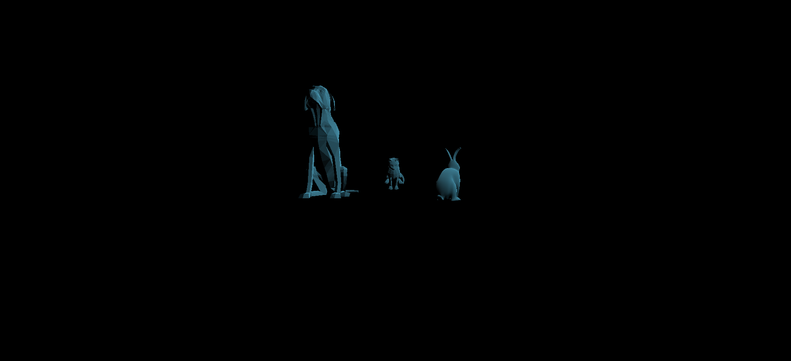

# CMPM163Labs
Labs for CMPM163

LAB 6
---------------------------------------------------------------------------------------------------------
Unity Scene Screenshot

LAB 5
---------------------------------------------------------------------------------------------------------
Lab 5 (part 1) Google Drive Link:
https://drive.google.com/file/d/1JPPqzvkbuJcaKrF0rbgi9KtAIlsyaUgW/view?usp=sharing

For the modification for the karting game: 
I added an additional smoke particle effect to the exhaust for the kart. 
I also modified and changed the current sky-box in the scene with another skybox found in the unity asset store. New skybox has a blue sky and white clouds.
For enviormental changes, I changed the track up adding more track prefabs along with a curve-up and curve-down ramp with two additional check points. I also added speed boost around the map after every checkpoint. I added a ramp where the player would accelerate up and land while crashing onto the bowling pins. Addtional directional lighting and buildings were also added to make it feel more of a city.

LAB 4
---------------------------------------------------------------------------------------------------------
Lab 4 Google Drive Link
https://drive.google.com/file/d/19GNRYjDjWFQGToirw-Jqs9vWbrAPL2rK/view?usp=sharing

Question 24 answers:
a. x = u * 7
b. y = (7 - 7v)
c. (2.625, 5.25) Color = gray.

Cube Explanations: Starting from the left

Cube1: Texture A. Followed the tutorial and built the cube using THREE.js built in texture functionality. Used texture "197.jpg"

Cube2: Texture A & Normal Map A. Followed the tutorial and built the cube using THREE.js texture functionality Used texture "197.jpg" and "197_norm.jpg"

Cube3: Texture B & Normal Map B. Used a new texture "161b.jpg" and a new normal map "161_norm.jpg". Created a new material1 variable that uses the THREE.js functionality to create a new mesh with the texture and normal map and implemented it onto the cube.

Cube4: Texture C. Followed the tutorial and implemented a new texture "172.jpg" with shaders and implemented this shader onto the cube.

Cube5: Texture D. Created a new fragment script "fragmentShader1.frag" and used a new visible texture "176.jpg," (2x2 grid).
In this new fragment script, I checked if the (x,y) coordinates of the grid were within the sample size of 1. If not then I would change the values until the (x,y) values of the UV coordinates were within the sample size.
Values with UV coordinates less than 0.5 which was the half of the sample size of 1 had their values multiplied by 2.0 to fit into the sample size
Values with UV coordinates greater than 0.5 had their values multiplied by 2.0 then subtracted by 1.0 to fit into the sample size
Values with x values greater than 0.5 had their values multiplied by 2.0 then subtracted by 1.0 and y values less than 0.5 were multiplied by 2.0.
Values with y values greater than 0.5 had their values multiplied by 2.0 then subtracted by 1.0 and x values less than 0.5 were multiplied by 2.0.

LAB 3
---------------------------------------------------------------------------------------
lab 3 Google Drive Video link
https://drive.google.com/file/d/1WvPc6M8OcPRab9Oy0QqxYMW6GfOtagq2/view?usp=sharing

Explanations: 
For the first cube starting from the left I used a new three.js material called THREE.MeshToonMaterial. For the material I also adjusted some proporties giving a bumpScale of 5, color changes, and a few tweaks in the specular and shiniess properites.

The second cube was made from the tutorial from Lab3 using the Phong material from Three.js.

The third cube was made from the tutorial from lab3 using vertex and fragment scripts to generate a custom shader.

For the forth cube I created a new fragment scripted name fragmentShader1.frag and created four new uniform vector3 colors. To start off I mixed two shades of colors Perano and Lightpink, then mixed this color was dark violet, and lastly added lavender into the mix. Once the colors were generated and mixed. I created a cube and added the custom ShaderMaterial onto the cube.

LAB 2
---------------------------------------------------------------------------------------
Part 1 Google Drive link 
https://drive.google.com/file/d/1L-w4AJihAWRspWG8ojld5iulsIqTSHeW/view?usp=sharing

Part 2 Image Screenshot

